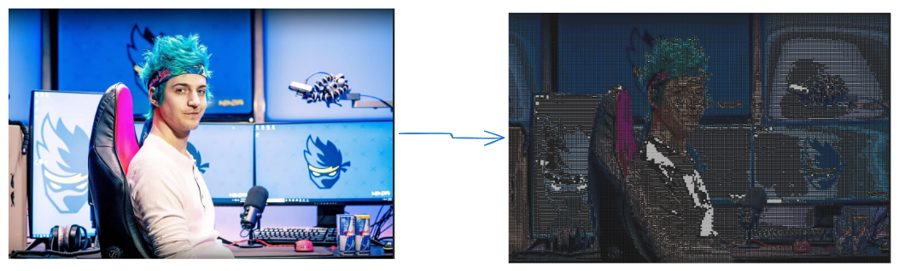

## Image to Text Image Converter

This is a free and user-friendly Image to Text Image Converter built using HTML, CSS, and JavaScript. It allows users to make text based images with additional customization features like light mode, adjustable pixel settings, and the ability to add new images dynamically.

👉 Check out the **[Live Demo](https://avinashtare.github.io/-Image-to-Text-Image-Converter/)** here! 🚀 Enjoy the experience! 👈

### 🌟 Features

- ✅ Upload Images – Select and process any image to extract text.
- ✅ Downlaod Image – Downlaod Image
- ✅ Add New Images – Easily upload and process multiple images.
- ✅ Light Mode Support – Toggle between light and dark modes for better readability.
- ✅ Adjust Pixel Settings – Modify pixel settings for better text recognition.
- ✅ Completely Free – No subscriptions, no limits!

### ⭐ Show Your Support

If you found this useful, give it a star ⭐ on GitHub and share it with others! 🚀

## License

This project is released under the [MIT License](LICENSE).

### Author

卐 🕉 Avinash Tare 🕉 卐

## Contact

**[avinashtare.work@gmail.com](mailto:avinashtare.work@gmail.com)**

## ⭐ Give it a Star

Found it interesting? Show your support by starring the repository on GitHub!

## Author

**卐 🕉 Avinash Tare 🕉 卐**
